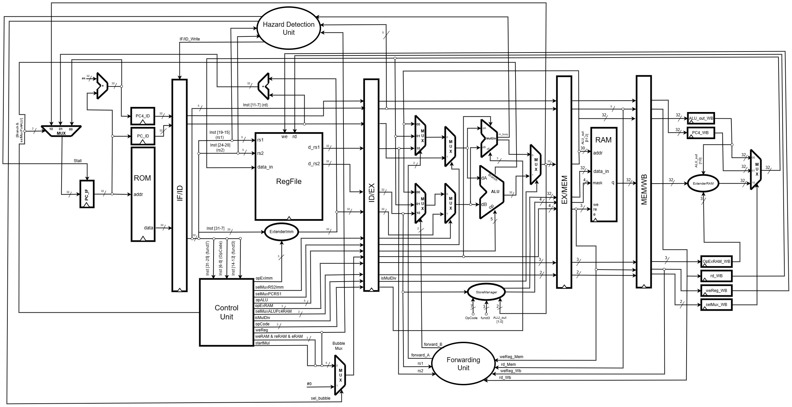

# Architecture of the core

The 5-stage in-order RV32IM pipeline, its hazard handling and the M extension. (This
text was the overview of the parent repository's README; the files it names are in
`common/`, `I/`, `M/` and `cores/` of this repository. The register-level detail is in
[PIPELINE_ARCHITECTURE_GUIDE.md](PIPELINE_ARCHITECTURE_GUIDE.md) and the decoder in
[DECODER.md](DECODER.md); the extension contract is in
[contracts/01-contrato-de-extensao.md](contracts/01-contrato-de-extensao.md).)



## Overview

This repository implements, in **VHDL**, a **RV32IM** processor (32-bit RISC-V base integer + M extension) organized as a **5-stage in-order pipeline** running at a single clock edge.

The project evolved from a prior RV32I **multi-cycle** core (3 clock cycles per instruction) into a fully pipelined design capable of issuing one instruction per cycle under normal conditions. The pipeline handles all classic hazard classes and integrates a combinational multiply/divide unit in parallel with the ALU.

### What was implemented

| Feature | Module |
|---------|--------|
| 5-stage pipeline (IF → ID → EX → MEM → WB) | `rv32im_pipeline_core.vhd` |
| Pipeline registers with `valid`, `flush` and `stall` | `reg_IF_ID`, `reg_ID_EX`, `reg_EX_MEM`, `reg_MEM_WB` |
| RAW forwarding (EX/MEM → EX, MEM/WB → EX) | `forwarding_unit.vhd` |
| Load-use hazard stall + opcode-aware detection | `hazard_detection_unit.vhd` + `bubble_mux.vhd` |
| Control hazard flush (branch, JAL, JALR) | `reg_IF_ID` + `reg_ID_EX` flush paths |
| Structural hazard elimination | Harvard architecture (separate ROM / RAM) |
| RV32M: MUL, MULH, MULHSU, MULHU, DIV, DIVU, REM, REMU | `multdiv.vhd` (Booth multiplier + non-restoring divider, stall via `muldiv_busy`) |
| Automated unit + integration tests | Cocotb + GHDL |
| FPGA synthesis | Quartus (Cyclone V — DE0-CV) |

---

## Architecture

### Pipeline stages

```
┌──────┐  reg_IF_ID  ┌──────┐  reg_ID_EX  ┌──────┐  reg_EX_MEM  ┌──────┐  reg_MEM_WB  ┌──────┐
│  IF  │ ──────────► │  ID  │ ──────────► │  EX  │ ───────────► │ MEM  │ ────────────► │  WB  │
└──────┘             └──────┘             └──────┘              └──────┘               └──────┘
   ▲                    │                    ▲  ▲                                          │
   │                    ▼                    │  │                                          │
   │              ┌──────────┐    ┌──────────────────┐                                    │
   │              │   HDU    │    │  Forwarding Unit  │                                    │
   │              │ (stall)  │    │  EX/MEM → EX      │                                    │
   │              └──────────┘    │  MEM/WB → EX      │                                    │
   │                              └──────────────────┘                                    │
   └──────────────────────────── wb_data (RegFile write-back) ◄──────────────────────────┘
```

### Hazard handling

#### RAW forwarding — `forwarding_unit.vhd`
Detects read-after-write dependencies between in-flight instructions and drives 3:1 muxes at the EX stage inputs. Priority: EX/MEM > MEM/WB. The forwarding source for MEM/WB is `wb_data` (the final WB mux output — ALU result, PC+4, or extended RAM data), so loads that complete in MEM are also forwarded correctly. The `valid` bit of each pipeline register is ANDed into the forwarding condition to prevent spurious forwarding from bubbles.

Encoding of `forward_A` / `forward_B`:
| Code | Source |
|------|--------|
| `"00"` | ID/EX — value read from RegFile in ID |
| `"10"` | EX/MEM — `exmem_alu_out` |
| `"01"` | MEM/WB — `wb_data` |

#### Load-use stall — `hazard_detection_unit.vhd` + `bubble_mux.vhd`
When a load is in EX (`idex_reRAM = '1'`) and the instruction in ID uses the load's destination register, a 1-cycle stall is inserted:
- PC and IF/ID are frozen (`if_pc_write_en`, `ifid_write_en` → `'0'`)
- A NOP bubble is injected into ID/EX (`id_bubble_sel` → `'1'`)

The HDU decodes the opcode of the instruction in ID to determine which source registers are actually read, preventing false stalls on I-type and load instructions whose `rs2` field encodes part of the immediate.

The `bubble_mux` zeroes only the five signals with side effects — `weReg`, `weRAM`, `reRAM`, `eRAM`, `startMul` — leaving the rest of the ID/EX packet intact.

#### Control hazard flush
Branch outcome and jump targets are resolved in EX. The strategy is **assume-not-taken**: if a branch or jump is confirmed taken, the two instructions already fetched are invalidated by flushing both IF/ID and ID/EX (`flush_if_id`, `flush_id_ex`).

| Instruction | Condition | Target |
|-------------|-----------|--------|
| Branch (`1100011`) | `ex_valid AND alu_branch_flag` | `PC + imm` |
| JAL (`1101111`) | `ex_valid` | `PC + imm` |
| JALR (`1100111`) | `ex_valid` | `(rs1 + imm) AND 0xFFFFFFFE` |

JALR takes priority over branch in the PC source mux.

#### Structural hazard
Avoided by the **Harvard architecture**: instructions are fetched from ROM and data is accessed via a separate RAM, so there is no port conflict between stages.

### RV32M — multiply and divide

The `multdiv.vhd` module implements all eight M-extension operations (MUL, MULH, MULHSU, MULHU, DIV, DIVU, REM, REMU) using a sequential Booth multiplier and a non-restoring divider. While an operation is in progress, `muldiv_busy` freezes the ID/EX, EX/MEM and MEM/WB registers via `muldiv_stall_n` until the result is ready. An extra stall cycle is inserted when `done` pulses, ensuring `saida_capt` has stabilised before the EX/MEM register captures it. The `isMulDiv` control signal selects the MulDiv result instead of the ALU result. Forwarding for M-extension results follows the same path as any other R-type instruction.

---

